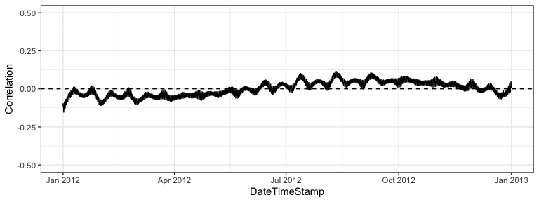
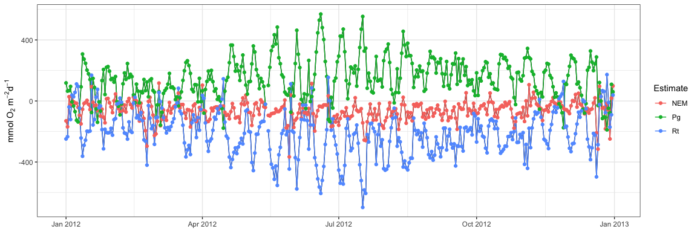
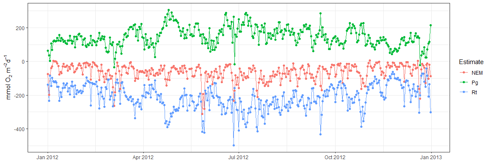

## WtRegDO

#### *Marcus W. Beck, <mbeck@tbep.org>*

[](https://github.com/fawda123/WtRegDO/actions)


This is the public repository of supplementary material to accompany the
manuscript “Improving estimates of ecosystem metabolism by reducing
effects of tidal advection on dissolved oxygen time series”, published
in Limnology and Oceanography Methods. The package includes a sample
dataset and functions to implement weighted regression on dissolved
oxygen time series to reduce the effects of tidal advection. Functions
are also available to estimate net ecosystem metabolism using the
open-water method.

The package can be installed from
[R-Universe](https://fawda123.r-universe.dev/) as follows:

``` r
# Enable universe(s) by fawda123
options(repos = c(
  fawda123 = 'https://fawda123.r-universe.dev',
  CRAN = 'https://cloud.r-project.org'))

# Install the package
install.packages('WtRegDO')
```

### Citation

Please cite this package using the manuscript.

*Beck MW, Hagy III JD, Murrell MC. 2015. Improving estimates of
ecosystem metabolism by reducing effects of tidal advection on dissolved
oxygen time series. Limnology and Oceanography Methods. 13(12):731-745.
DOI:
[10.1002/lom3.10062](http://onlinelibrary.wiley.com/doi/10.1002/lom3.10062/abstract)*

### Functions

A sample dataset, `SAPDC`, is included with the package that
demonstrates the required format of the data. All functions require data
with the same format, with no missing values in the tidal depth column.
See the help files for details.

``` r
# load library and sample data
library(WtRegDO)
head(SAPDC)
```

    ##         DateTimeStamp Temp  Sal DO_obs ATemp   BP WSpd      Tide
    ## 1 2012-01-01 00:00:00 14.9 33.3    5.0  11.9 1022  0.5 0.8914295
    ## 2 2012-01-01 00:30:00 14.9 33.4    5.5  11.3 1022  0.6 1.0011830
    ## 3 2012-01-01 01:00:00 14.9 33.4    5.9   9.9 1021  0.6 1.0728098
    ## 4 2012-01-01 01:30:00 14.8 33.3    6.4  10.0 1022  2.4 1.1110885
    ## 5 2012-01-01 02:00:00 14.7 33.2    6.6  11.4 1022  1.3 1.1251628
    ## 6 2012-01-01 02:30:00 14.7 33.3    6.1  10.7 1021  0.0 1.1223799

Before applying weighted regression, the data should be checked with the
`evalcor` function to identify locations in the time series when tidal
and solar changes are not correlated. In general, the `wtreg` function
for weighted regression will be most effective when correlations between
the two are zero, whereas `wtreg` will remove both the biological and
physical components of the dissolved oxygen time series when the sun and
tide are correlated. The correlation between tide change and sun angle
is estimated using a moving window for the time series. Tide changes are
estimated as angular rates for the tidal height vector and sun angles
are estimated from the time of day and geographic location. Correlations
are low for the sample dataset, suggesting the results from weighted
regression are reasonable for the entire time series.

``` r
data(SAPDC)

# metadata for the location
tz <- 'America/Jamaica'
lat <- 31.39
long <- -81.28

# setup parallel backend
library(doParallel)
ncores <- detectCores()  
registerDoParallel(cores = ncores - 1)

# run the function
evalcor(SAPDC, tz, lat, long)
```

<!-- -->

The `wtreg` function can be used to detide the dissolved oxygen time
series. The example below demonstrates detiding, following by a
comparison of ecosystem metabolism using the observed and detided data.

``` r
# run weighted regression in parallel
# requires parallel backend
library(doParallel)
ncores <- detectCores()  
registerDoParallel(cores = ncores - 1)

# metadata for the location
tz <- 'America/Jamaica'
lat <- 31.39
long <- -81.28

# weighted regression, optimal window widths for SAPDC from the paper
wtreg_res <- wtreg(SAPDC, parallel = TRUE, wins = list(3, 1, 0.6), 
  tz = tz, lat = lat, long = long)

# estimate ecosystem metabolism using observed DO time series
metab_obs <- ecometab(wtreg_res, DO_var = 'DO_obs', tz = tz, 
  lat = lat, long = long)

# estimate ecosystem metabolism using detided DO time series
metab_dtd <- ecometab(wtreg_res, DO_var = 'DO_nrm', tz = tz, 
  lat = lat, long = long)
```

The `meteval` function provides summary statistics of metabolism results
to evaluate the effectiveness of weighted regression. These estimates
are mean production, standard deviation of production, percent of
production estimates that were anomalous, mean respiration, standard
deviation of respiration, percent of respiration estimates that were
anomalous, correlation of dissolved oxygen with tidal height changes,
correlation of production with tidal height changes, and the correlation
of respiration with tidal height changes. The correlation estimates are
based on an average of separate correlations by each month in the time
series. Dissolved oxygen is correlated directly with tidal height at
each time step. The metabolic estimates are correlated with the tidal
height ranges during the day for production and during the night for
respiration.

In general, useful results for weighted regression are those that remove
the correlation of dissolved oxygen, production, and respiration with
tidal changes. Similarly, the mean estimates of metabolism should not
change if a long time series is evaluated, whereas the standard
deviation and percent anomalous estimates should decrease.

``` r
# evaluate before weighted regression
meteval(metab_obs)
```

    ## $cmp
    ##     meanPg     sdPg  anomPg   meanRt     sdRt   anomRt
    ## 1 144.7873 136.1942 14.7541 -206.549 150.4015 8.743169
    ## 
    ## $mos
    ##    month     DOcor      Pgcor     Rtcor    meanPg      sdPg    anomPg    meanRt
    ## 1     01 0.6629739  0.6128670 0.8046163  77.38486 127.84961 35.483871 -118.0351
    ## 2     02 0.6201615  0.3431700 0.4587804  87.09363  78.42735 20.689655 -141.6382
    ## 3     03 0.5994644 -0.4354938 0.6782440  74.98689  99.39817 19.354839 -140.7284
    ## 4     04 0.4982277  0.4670378 0.6097013 132.13785 127.13391 13.333333 -190.6851
    ## 5     05 0.5294769  0.8160570 0.6945840 168.43938 148.02470  9.677419 -240.5775
    ## 6     06 0.5897916  0.7830600 0.7440561 175.51545 198.38113 20.000000 -255.5384
    ## 7     07 0.7460453  0.6279141 0.7197303 229.58477 139.85175  0.000000 -330.4972
    ## 8     08 0.7258924  0.3458401 0.7118865 211.32715 122.45633  3.225806 -281.8525
    ## 9     09 0.6740068  0.1610746 0.5256303 191.01108  78.90767  0.000000 -256.7310
    ## 10    10 0.5297918  0.3417159 0.4351341 169.08577  83.70386  3.225806 -225.0041
    ## 11    11 0.6395857  0.5343315 0.6627093 119.41562 126.85041 16.666667 -147.1073
    ## 12    12 0.6273607  0.5082501 0.5426491  98.99934 151.02162 35.483871 -146.7747
    ##         sdRt    anomRt
    ## 1  139.87492 25.806452
    ## 2  104.09643  6.896552
    ## 3  109.75258  6.451613
    ## 4  147.39672 13.333333
    ## 5  166.19746  6.451613
    ## 6  197.03001 10.000000
    ## 7  162.17212  0.000000
    ## 8  121.79179  0.000000
    ## 9   83.61291  0.000000
    ## 10  71.44440  0.000000
    ## 11 133.66884 16.666667
    ## 12 157.32741 19.354839

``` r
# evaluate after weighted regression
meteval(metab_dtd)
```

    ## $cmp
    ##    meanPg     sdPg    anomPg    meanRt     sdRt anomRt
    ## 1 146.834 57.53115 0.8196721 -209.9807 74.51551      0
    ## 
    ## $mos
    ##    month       DOcor       Pgcor       Rtcor   meanPg     sdPg   anomPg
    ## 1     01  0.07685187 -0.30002070  0.53502991 116.1058 34.94184 0.000000
    ## 2     02  0.01188972  0.02151787  0.27320141 117.1716 29.80104 0.000000
    ## 3     03 -0.07073666 -0.15104204 -0.08332307 140.4562 63.19542 3.225806
    ## 4     04 -0.18382785 -0.07969587 -0.03988212 169.9445 76.40250 0.000000
    ## 5     05 -0.10951014  0.50533629 -0.08525539 177.7526 39.09936 0.000000
    ## 6     06 -0.05819164  0.23617388 -0.00500184 159.5154 71.64822 3.333333
    ## 7     07  0.01660273 -0.32827646 -0.02425000 196.9327 49.77138 0.000000
    ## 8     08  0.06819722 -0.52435885  0.11804602 167.7937 30.12942 0.000000
    ## 9     09  0.10693056 -0.39237388  0.45676054 150.6838 51.63451 0.000000
    ## 10    10  0.11608243 -0.34503526 -0.61002701 154.9823 47.58537 0.000000
    ## 11    11  0.07389502 -0.03939680  0.26813321 100.6375 31.79615 0.000000
    ## 12    12 -0.10185960  0.01582041 -0.28058193 107.9069 50.06520 3.225806
    ##       meanRt     sdRt anomRt
    ## 1  -155.9362 37.01674      0
    ## 2  -163.7338 49.68894      0
    ## 3  -211.5901 52.43905      0
    ## 4  -236.3027 79.37054      0
    ## 5  -252.9955 62.52607      0
    ## 6  -240.4571 72.51770      0
    ## 7  -292.0207 66.04030      0
    ## 8  -238.6631 38.47627      0
    ## 9  -218.7634 65.10781      0
    ## 10 -217.8569 66.57438      0
    ## 11 -131.8695 44.82689      0
    ## 12 -156.1912 63.84012      0

Plot metabolism results from observed dissolved oxygen time series (see
`?plot.metab` for options). Note the periodicity with fortnightly tidal
variation and instances with negative production/positive respiration.

``` r
plot(metab_obs, by = 'days')
```

<!-- -->

Plot metabolism results from detided dissolved oxygen time series.

``` r
plot(metab_dtd, by = 'days')
```

<!-- -->

### Optimization

A critical component of weighted regression is choosing the window
widths. The chosen values affect the relative degree of smoothing in
both predicted and detided dissolved oxygen time series. There are no
strict rules for choosing window widths, but several rules of thumb can
be applied that assess the relative ability of the method in removing
the tidal signal in metabolism estimates. The `meteval` function
measures many of these rules of thumb and optimization functions have
been included in WtRegDO that attempt to identify window widths to
achieve detided time series that satisfy these rules.

The `winopt` function attempts to find optimal window widths for a given
time series. There are several functions used internally within `winopt`
that quantify relative ability of a detided metabolism estimate to
achieve the rules of thumb for a desired result. Specifically, improved
estimates are assumed to have lower anomalies (less negative production
and positive respiration values), lower standard deviation, and similar
mean values for gross production and respiration between the observed
and detided estimates. The detided and observed metabolism estimates are
compared during the optimization routine using the `objfun` function
that returns a single numeric value that is to be optimized as a measure
of how well a detided metabolism estimate achieves the rules of thumb.

The `objfun` function evaluates the detided metabolism estimates based
on a sum of percent differences for the six paired measures for percent
anomalous production, percent anomalous respiration, mean production,
mean respiration, standard deviation of production, and standard
deviation of respiration for the estimates from the observed and detided
metabolism. The comparisons of the means are taken as the inverse (1 /
mean) such that optimization should attempt to keep the values as
similar as possible. The final sum is multiplied by negative one such
that the value is to be optimized by minimization, i.e., a lower value
indicates improved detiding across all measures. The function can also
quantify a comparison based on different measures supplied by the user.
By default, all six measures are used. However, selecting specific
measures, such as only optimizing by reducing anomalous values, may be
preferred. Changing the argument for `vls` changes which comparisons are
used for the summary value. In practice, choosing less rules of thumb to
optimize is more likely to lead to an obtainable result for minimizing
the objective function.

Using the `winopt` function requires similar inputs as the `wtreg`
function.

``` r
# run optimiztaion in parallel
# requires parallel backend
library(foreach)
library(doParallel)

ncores <- detectCores()
cl <- makeCluster(ncores)
registerDoParallel(cl)

data(SAPDC)

tz <- 'America/Jamaica'
lat <- 31.39
long <- -81.28

# find optimal window widths for reducing anomalous metabolism estimates
winopt(SAPDC, tz = tz, lat = lat, long = long, wins = list(6, 6, 0.5), parallel = T, vls = c('anomPg', 'anomRt'))

stopCluser(cl)
```

The optimization function can take several hours to run and, if it
works, should return three window widths for day, hour, and tide that
achieve the rules of thumb. The above example should return window
widths that minimize only the anomalous metabolism estimates. It’s worth
noting that the “optimization surface” for the objective function is
very irregular and the optimization function may not converge to a
solution or may be trapped in a local minima. For these reasons, it’s
often easier and less time consuming to create a regular grid of window
widths to search and use the `objfun` function separately to manually
identify an approximate solution. An example for using a grid search can
be found
[here](https://github.com/fawda123/detide_eval/blob/9baf6dfbf7eec0b6b6b14ce340e5b387569ae05c/R/dat_proc.R#L67).

### License

This package is released in the public domain under the creative commons
license
[CC0](https://tldrlegal.com/license/creative-commons-cc0-1.0-universal).
