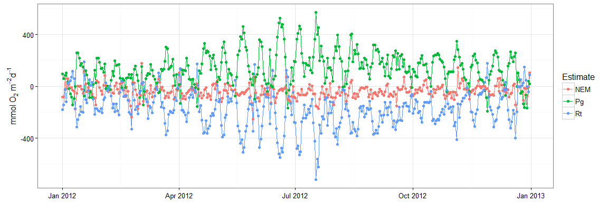

## WtRegDO

#### *Marcus W. Beck, beck.marcus@epa.gov*

Linux: [](https://travis-ci.org/fawda123/WtRegDO)

Windows: [](https://ci.appveyor.com/project/fawda123/WtRegDO)

This is the public repository of supplementary material to accompany the manuscript "Improving estimates of ecosystem metabolism by reducing effects of tidal advection on dissolved oxygen time series", submitted to Limnology and Oceanography Methods.  The package includes a sample dataset and functions to implement weighted regression on dissolved oxygen time series to reduce the effects of tidal advection.  Functions are also available to estimate net ecosystem metabolism using the open-water method.  

The development version of this package can be installed from Github:


```r
install.packages('devtools')
library(devtools)
install_github('fawda123/WtRegDO')
```

### Citation

Please cite this package using the manuscript.

*Beck MW, Hagy III JD, Murrell MC. 2015. Improving estimates of ecosystem metabolism by reducing effects of tidal advection on dissolved oxygen time series. Limnology and Oceanography Methods. 13(12):731-745. DOI: [10.1002/lom3.10062](http://onlinelibrary.wiley.com/doi/10.1002/lom3.10062/abstract)*

### Functions

Load the sample dataset and run weighted regression.  See the function help files for details.


```r
# load library and sample data
library(WtRegDO)
data(SAPDC)

# run weighted regression in parallel
# requires parallel backend
library(doParallel)
registerDoParallel(cores = 7)

# metadata for the location
tz <- 'America/Jamaica'
lat <- 31.39
long <- -89.28

# weighted regression, optimal window widths for SAPDC from the paper
wtreg_res <- wtreg(SAPDC, parallel = TRUE, wins = list(3, 1, 0.6), progress = TRUE, 
  tz = tz, lat = lat, long = long)

# estimate ecosystem metabolism using observed DO time series
metab_obs <- ecometab(wtreg_res, DO_var = 'DO_obs', tz = tz, 
  lat = lat, long = long)

# estimate ecosystem metabolism using detided DO time series
metab_dtd <- ecometab(wtreg_res, DO_var = 'DO_nrm', tz = tz, 
  lat = lat, long = long)
```

The `meteval` function provides summary statistics of metabolism results to evaluate the effectiveness of weighted regression.  These estimates are mean production, standard deviation of production, percent of production estimates that were anomalous, mean respiration, standard deviation of respiration, percent of respiration estimates that were anomalous, correlation of dissolved oxygen with tidal height changes, correlation of production with tidal height changes, and the correlation of respiration with tidal height changes.  The correlation estimates are based on an average of separate correlations by each month in the time series.  Dissolved oxygen is correlated directly with tidal height at each time step.  The metabolic estimates are correlated with the tidal height ranges during the day for production and during the night for respiration.  

In general, useful results for weighted regression are those that remove the correlation of dissolved oxygen, production, and respiration with tidal changes.  Similarly, the mean estimates of metabolism should not change if a long time series is evaluated, whereas the standard deviation and percent anomalous estimates should decrease.


```r
# evaluate before weighted regression
meteval(metab_obs)
```

```
## $meanPg
## [1] 136.0918
## 
## $sdPg
## [1] 129.9487
## 
## $anomPg
## [1] 14.52055
## 
## $meanRt
## [1] -174.5961
## 
## $sdRt
## [1] 143.112
## 
## $anomRt
## [1] 10.41096
## 
## $DOcor.month
##  [1] "01" "02" "03" "04" "05" "06" "07" "08" "09" "10" "11" "12"
## 
## $DOcor.cor
##  [1] 0.6637291 0.6190974 0.6004334 0.4983921 0.5289581 0.5894151 0.7458457
##  [8] 0.7261328 0.6739781 0.5297470 0.6395344 0.6271354
## 
## $month
##  [1] "01" "02" "03" "04" "05" "06" "07" "08" "09" "10" "11" "12"
## 
## $Pgcor
##  [1]  0.5855800  0.3175887 -0.3562183  0.4885538  0.8421015  0.7919766
##  [7]  0.7118354  0.1796495  0.0594478  0.4742226  0.5419348  0.4643577
## 
## $Rtcor
##  [1] 0.7213334 0.4628575 0.7812258 0.6185484 0.7625915 0.7487531 0.7674479
##  [8] 0.7457532 0.8046064 0.6156189 0.6875412 0.5381141
```

```r
# evaluate after weighted regression
meteval(metab_dtd)
```

```
## $meanPg
## [1] 135.3959
## 
## $sdPg
## [1] 49.21859
## 
## $anomPg
## [1] 0
## 
## $meanRt
## [1] -174.8359
## 
## $sdRt
## [1] 58.77977
## 
## $anomRt
## [1] 0
## 
## $DOcor.month
##  [1] "01" "02" "03" "04" "05" "06" "07" "08" "09" "10" "11" "12"
## 
## $DOcor.cor
##  [1]  0.07870710  0.01131530 -0.06950567 -0.18395007 -0.10768210
##  [6] -0.05824140  0.01614504  0.06841365  0.10683226  0.11687569
## [11]  0.07368755 -0.10198817
## 
## $month
##  [1] "01" "02" "03" "04" "05" "06" "07" "08" "09" "10" "11" "12"
## 
## $Pgcor
##  [1] -0.47954765  0.02699337  0.02219251 -0.02092694  0.60293642
##  [6]  0.27435024 -0.22756992 -0.62069363 -0.53048256 -0.36986621
## [11] -0.09005135 -0.06758431
## 
## $Rtcor
##  [1]  0.22541894  0.28820259 -0.19785004  0.02907434  0.10522547
##  [6]  0.08964735  0.11499784  0.16384986  0.76111970 -0.50026397
## [11]  0.17767841 -0.33802579
```

Plot metabolism results from observed dissolved oxygen time series (see `?plot.metab` for options).  Note the periodicity with fortnightly tidal variation and instances with negative production/positive respiration.


```r
plot(metab_obs, by = 'days')
```

<!-- -->

Plot metabolism results from detided dissolved oxygen time series.


```r
plot(metab_dtd, by = 'days')
```

<!-- -->

The `evalcor` function can be used before weighted regression to identify locations in the time series when tidal and solar changes are not correlated.  In general, the `wtreg` will be most effective when correlations between the two are zero, whereas `wtreg` will remove both the biological and physical components of the dissolved oxygen time series when the sun and tide are correlated.   The correlation between tide change and sun angle is estimated using a moving window for the time series.  Tide changes are estimated as angular rates for the tidal height vector and sun angles are estimated from the time of day and geographic location.  Correlations are low for the sample dataset, suggesting the results from weighted regression are valid for the entire time series.


```r
data(SAPDC)

# metadata for the location
tz <- 'America/Jamaica'
lat <- 31.39
long <- -89.28

# setup parallel backend
library(doParallel)
registerDoParallel(cores = 7)

# run the function
evalcor(SAPDC, tz, lat, long, progress = TRUE)
```

 

### License

This package is released in the public domain under the creative commons license [CC0](https://tldrlegal.com/license/creative-commons-cc0-1.0-universal). 
