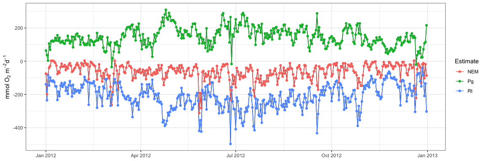

## WtRegDO

#### *Marcus W. Beck, <mbeck@tbep.org>*

Linux: [](https://travis-ci.org/fawda123/WtRegDO)

Windows: [](https://ci.appveyor.com/project/fawda123/WtRegDO)

This is the public repository of supplementary material to accompany the
manuscript “Improving estimates of ecosystem metabolism by reducing
effects of tidal advection on dissolved oxygen time series”, published
in Limnology and Oceanography Methods. The package includes a sample
dataset and functions to implement weighted regression on dissolved
oxygen time series to reduce the effects of tidal advection. Functions
are also available to estimate net ecosystem metabolism using the
open-water method.

The development version of this package can be installed from Github:

``` r
install.packages('devtools')
library(devtools)
install_github('fawda123/WtRegDO')
```

### Citation

Please cite this package using the manuscript.

*Beck MW, Hagy III JD, Murrell MC. 2015. Improving estimates of
ecosystem metabolism by reducing effects of tidal advection on dissolved
oxygen time series. Limnology and Oceanography Methods. 13(12):731-745.
DOI:
[10.1002/lom3.10062](http://onlinelibrary.wiley.com/doi/10.1002/lom3.10062/abstract)*

### Functions

A sample dataset, `SAPDC`, is included with the package that
demonstrates the required format of the data. All functions require data
with the same format, with no missing values in the tidal depth column.
See the help files for details.

``` r
# load library and sample data
library(WtRegDO)
head(SAPDC)
```

    ##         DateTimeStamp Temp  Sal DO_obs ATemp   BP WSpd      Tide
    ## 1 2012-01-01 00:00:00 14.9 33.3    5.0  11.9 1022  0.5 0.8914295
    ## 2 2012-01-01 00:30:00 14.9 33.4    5.5  11.3 1022  0.6 1.0011830
    ## 3 2012-01-01 01:00:00 14.9 33.4    5.9   9.9 1021  0.6 1.0728098
    ## 4 2012-01-01 01:30:00 14.8 33.3    6.4  10.0 1022  2.4 1.1110885
    ## 5 2012-01-01 02:00:00 14.7 33.2    6.6  11.4 1022  1.3 1.1251628
    ## 6 2012-01-01 02:30:00 14.7 33.3    6.1  10.7 1021  0.0 1.1223799

Before applying weighted regression, the data should be checked with the
`evalcor` function to identify locations in the time series when tidal
and solar changes are not correlated. In general, the `wtreg` function
for weighted regression will be most effective when correlations between
the two are zero, whereas `wtreg` will remove both the biological and
physical components of the dissolved oxygen time series when the sun and
tide are correlated. The correlation between tide change and sun angle
is estimated using a moving window for the time series. Tide changes are
estimated as angular rates for the tidal height vector and sun angles
are estimated from the time of day and geographic location. Correlations
are low for the sample dataset, suggesting the results from weighted
regression are reasonable for the entire time series.

``` r
data(SAPDC)

# metadata for the location
tz <- 'America/Jamaica'
lat <- 31.39
long <- -89.28

# setup parallel backend
library(doParallel)
ncores <- detectCores()  
registerDoParallel(cores = ncores - 1)

# run the function
evalcor(SAPDC, tz, lat, long, progress = TRUE)
```

<!-- -->

<!--   -->

The `wtreg` function can be used to detide the dissolved oxygen time
series. The example below demonstrates detiding, following by a
comparison of ecosystem metabolism using the observed and detided data.

``` r
# run weighted regression in parallel
# requires parallel backend
library(doParallel)
ncores <- detectCores()  
registerDoParallel(cores = ncores - 1)

# metadata for the location
tz <- 'America/Jamaica'
lat <- 31.39
long <- -89.28

# weighted regression, optimal window widths for SAPDC from the paper
wtreg_res <- wtreg(SAPDC, parallel = TRUE, wins = list(3, 1, 0.6), progress = TRUE, 
  tz = tz, lat = lat, long = long)

# estimate ecosystem metabolism using observed DO time series
metab_obs <- ecometab(wtreg_res, DO_var = 'DO_obs', tz = tz, 
  lat = lat, long = long)

# estimate ecosystem metabolism using detided DO time series
metab_dtd <- ecometab(wtreg_res, DO_var = 'DO_nrm', tz = tz, 
  lat = lat, long = long)
```

The `meteval` function provides summary statistics of metabolism results
to evaluate the effectiveness of weighted regression. These estimates
are mean production, standard deviation of production, percent of
production estimates that were anomalous, mean respiration, standard
deviation of respiration, percent of respiration estimates that were
anomalous, correlation of dissolved oxygen with tidal height changes,
correlation of production with tidal height changes, and the correlation
of respiration with tidal height changes. The correlation estimates are
based on an average of separate correlations by each month in the time
series. Dissolved oxygen is correlated directly with tidal height at
each time step. The metabolic estimates are correlated with the tidal
height ranges during the day for production and during the night for
respiration.

In general, useful results for weighted regression are those that remove
the correlation of dissolved oxygen, production, and respiration with
tidal changes. Similarly, the mean estimates of metabolism should not
change if a long time series is evaluated, whereas the standard
deviation and percent anomalous estimates should decrease.

``` r
# evaluate before weighted regression
meteval(metab_obs)
```

    ## $meanPg
    ## [1] 136.0918
    ## 
    ## $sdPg
    ## [1] 129.9487
    ## 
    ## $anomPg
    ## [1] 14.52055
    ## 
    ## $meanRt
    ## [1] -174.5961
    ## 
    ## $sdRt
    ## [1] 143.112
    ## 
    ## $anomRt
    ## [1] 10.41096
    ## 
    ## $DOcor.month
    ##  [1] "01" "02" "03" "04" "05" "06" "07" "08" "09" "10" "11" "12"
    ## 
    ## $DOcor.cor
    ##  [1] 0.6629739 0.6201615 0.5994644 0.4982277 0.5294769 0.5897916 0.7460453
    ##  [8] 0.7258924 0.6740068 0.5297918 0.6395857 0.6273607
    ## 
    ## $month
    ##  [1] "01" "02" "03" "04" "05" "06" "07" "08" "09" "10" "11" "12"
    ## 
    ## $Pgcor
    ##  [1]  0.5855800  0.3175887 -0.3562183  0.4885538  0.8421015  0.7919766
    ##  [7]  0.7118354  0.1796495  0.0594478  0.4742226  0.5419348  0.4643577
    ## 
    ## $Rtcor
    ##  [1] 0.7213334 0.4628575 0.7812258 0.6185484 0.7625915 0.7487531 0.7674479
    ##  [8] 0.7457532 0.8046064 0.6156189 0.6875412 0.5381141

``` r
# evaluate after weighted regression
meteval(metab_dtd)
```

    ## $meanPg
    ## [1] 135.3108
    ## 
    ## $sdPg
    ## [1] 49.06517
    ## 
    ## $anomPg
    ## [1] 0
    ## 
    ## $meanRt
    ## [1] -174.7291
    ## 
    ## $sdRt
    ## [1] 58.59495
    ## 
    ## $anomRt
    ## [1] 0
    ## 
    ## $DOcor.month
    ##  [1] "01" "02" "03" "04" "05" "06" "07" "08" "09" "10" "11" "12"
    ## 
    ## $DOcor.cor
    ##  [1]  0.07685187  0.01188972 -0.07073666 -0.18382785 -0.10951014 -0.05819164
    ##  [7]  0.01660273  0.06819722  0.10693056  0.11608243  0.07389502 -0.10185960
    ## 
    ## $month
    ##  [1] "01" "02" "03" "04" "05" "06" "07" "08" "09" "10" "11" "12"
    ## 
    ## $Pgcor
    ##  [1] -0.48236002  0.02667083  0.02178988 -0.02077948  0.60108280  0.27251181
    ##  [7] -0.22694664 -0.62218643 -0.52986515 -0.36963667 -0.09200448 -0.05817860
    ## 
    ## $Rtcor
    ##  [1]  0.22319792  0.28832913 -0.19717480  0.02937412  0.10177330  0.08717352
    ##  [7]  0.11542862  0.16233587  0.76102742 -0.50028988  0.17584829 -0.27360995

Plot metabolism results from observed dissolved oxygen time series (see
`?plot.metab` for options). Note the periodicity with fortnightly tidal
variation and instances with negative production/positive respiration.

``` r
plot(metab_obs, by = 'days')
```

<!-- -->

Plot metabolism results from detided dissolved oxygen time series.

``` r
plot(metab_dtd, by = 'days')
```

<!-- -->

### License

This package is released in the public domain under the creative commons
license
[CC0](https://tldrlegal.com/license/creative-commons-cc0-1.0-universal).
