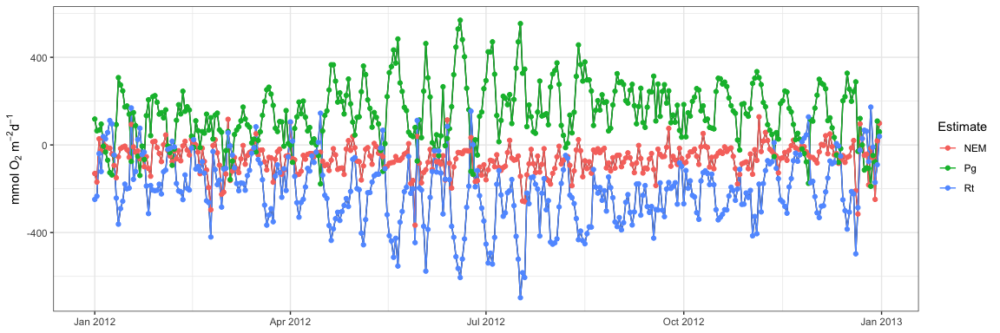

## WtRegDO

#### *Marcus W. Beck, <mbeck@tbep.org>*

[](https://github.com/fawda123/WtRegDO/actions)


This is the public repository of supplementary material to accompany the
manuscript “Improving estimates of ecosystem metabolism by reducing
effects of tidal advection on dissolved oxygen time series”, published
in Limnology and Oceanography Methods. The package includes a sample
dataset and functions to implement weighted regression on dissolved
oxygen time series to reduce the effects of tidal advection. Functions
are also available to estimate net ecosystem metabolism using the
open-water method.

The package can be installed from
[R-Universe](https://fawda123.r-universe.dev/) as follows:

``` r
# Enable universe(s) by fawda123
options(repos = c(
  fawda123 = 'https://fawda123.r-universe.dev',
  CRAN = 'https://cloud.r-project.org'))

# Install the package
install.packages('WtRegDO')
```

### Citation

Please cite this package using the manuscript.

*Beck MW, Hagy III JD, Murrell MC. 2015. Improving estimates of
ecosystem metabolism by reducing effects of tidal advection on dissolved
oxygen time series. Limnology and Oceanography Methods. 13(12):731-745.
DOI:
[10.1002/lom3.10062](http://onlinelibrary.wiley.com/doi/10.1002/lom3.10062/abstract)*

### Functions

A sample dataset, `SAPDC`, is included with the package that
demonstrates the required format of the data. All functions require data
with the same format, with no missing values in the tidal depth column.
See the help files for details.

``` r
# load library and sample data
library(WtRegDO)
head(SAPDC)
```

    ##         DateTimeStamp Temp  Sal DO_obs ATemp   BP WSpd      Tide
    ## 1 2012-01-01 00:00:00 14.9 33.3    5.0  11.9 1022  0.5 0.8914295
    ## 2 2012-01-01 00:30:00 14.9 33.4    5.5  11.3 1022  0.6 1.0011830
    ## 3 2012-01-01 01:00:00 14.9 33.4    5.9   9.9 1021  0.6 1.0728098
    ## 4 2012-01-01 01:30:00 14.8 33.3    6.4  10.0 1022  2.4 1.1110885
    ## 5 2012-01-01 02:00:00 14.7 33.2    6.6  11.4 1022  1.3 1.1251628
    ## 6 2012-01-01 02:30:00 14.7 33.3    6.1  10.7 1021  0.0 1.1223799

Before applying weighted regression, the data should be checked with the
`evalcor` function to identify locations in the time series when tidal
and solar changes are not correlated. In general, the `wtreg` function
for weighted regression will be most effective when correlations between
the two are zero, whereas `wtreg` will remove both the biological and
physical components of the dissolved oxygen time series when the sun and
tide are correlated. The correlation between tide change and sun angle
is estimated using a moving window for the time series. Tide changes are
estimated as angular rates for the tidal height vector and sun angles
are estimated from the time of day and geographic location. Correlations
are low for the sample dataset, suggesting the results from weighted
regression are reasonable for the entire time series.

``` r
data(SAPDC)

# metadata for the location
tz <- 'America/Jamaica'
lat <- 31.39
long <- -81.28

# setup parallel backend
library(doParallel)
ncores <- detectCores()  
registerDoParallel(cores = ncores - 1)

# run the function
evalcor(SAPDC, tz, lat, long, progress = TRUE)
```

<!-- -->

The `wtreg` function can be used to detide the dissolved oxygen time
series. The example below demonstrates detiding, following by a
comparison of ecosystem metabolism using the observed and detided data.

``` r
# run weighted regression in parallel
# requires parallel backend
library(doParallel)
ncores <- detectCores()  
registerDoParallel(cores = ncores - 1)

# metadata for the location
tz <- 'America/Jamaica'
lat <- 31.39
long <- -81.28

# weighted regression, optimal window widths for SAPDC from the paper
wtreg_res <- wtreg(SAPDC, parallel = TRUE, wins = list(3, 1, 0.6), progress = TRUE, 
  tz = tz, lat = lat, long = long)

# estimate ecosystem metabolism using observed DO time series
metab_obs <- ecometab(wtreg_res, DO_var = 'DO_obs', tz = tz, 
  lat = lat, long = long)

# estimate ecosystem metabolism using detided DO time series
metab_dtd <- ecometab(wtreg_res, DO_var = 'DO_nrm', tz = tz, 
  lat = lat, long = long)
```

The `meteval` function provides summary statistics of metabolism results
to evaluate the effectiveness of weighted regression. These estimates
are mean production, standard deviation of production, percent of
production estimates that were anomalous, mean respiration, standard
deviation of respiration, percent of respiration estimates that were
anomalous, correlation of dissolved oxygen with tidal height changes,
correlation of production with tidal height changes, and the correlation
of respiration with tidal height changes. The correlation estimates are
based on an average of separate correlations by each month in the time
series. Dissolved oxygen is correlated directly with tidal height at
each time step. The metabolic estimates are correlated with the tidal
height ranges during the day for production and during the night for
respiration.

In general, useful results for weighted regression are those that remove
the correlation of dissolved oxygen, production, and respiration with
tidal changes. Similarly, the mean estimates of metabolism should not
change if a long time series is evaluated, whereas the standard
deviation and percent anomalous estimates should decrease.

``` r
# evaluate before weighted regression
meteval(metab_obs)
```

    ## $cmp
    ##    meanPg     sdPg   anomPg    meanRt     sdRt   anomRt
    ## 1 146.099 135.2549 14.52055 -207.9208 149.4671 8.493151
    ## 
    ## $mos
    ##    month     DOcor      Pgcor     Rtcor    meanPg      sdPg    anomPg    meanRt
    ## 1     01 0.6581818  0.6192811 0.8006390  78.36200 128.75015 35.483871 -118.6644
    ## 2     02 0.6187169  0.3213720 0.4146755  87.18652  78.29807 20.689655 -141.4157
    ## 3     03 0.5992321 -0.4618578 0.6607598  73.72440  99.43378 22.580645 -139.5572
    ## 4     04 0.5014744  0.4489053 0.5975186 134.18009 125.26793 10.000000 -192.8716
    ## 5     05 0.5299598  0.8173805 0.6866777 181.47192 137.17979  6.666667 -253.9974
    ## 6     06 0.5891833  0.7830729 0.7440561 175.54562 198.41327 20.000000 -255.5384
    ## 7     07 0.7478984  0.6279178 0.7197303 229.53809 139.83412  0.000000 -330.4972
    ## 8     08 0.7237825  0.3216636 0.6916004 213.90730 119.22099  3.225806 -284.8261
    ## 9     09 0.6745390  0.1644472 0.5135926 189.71236  79.66843  0.000000 -255.3576
    ## 10    10 0.5297497  0.3619763 0.4317527 170.50533  84.26589  3.225806 -226.2594
    ## 11    11 0.6410947  0.5458636 0.6807180 118.33396 125.41521 16.666667 -146.9265
    ## 12    12 0.6302150  0.5107706 0.5444025  99.13726 151.24334 35.483871 -146.9472
    ##         sdRt    anomRt
    ## 1  140.20097 25.806452
    ## 2  104.29302  6.896552
    ## 3  109.05095  6.451613
    ## 4  143.09897 13.333333
    ## 5  156.45483  3.333333
    ## 6  197.03001 10.000000
    ## 7  162.17212  0.000000
    ## 8  118.79698  0.000000
    ## 9   84.42652  0.000000
    ## 10  71.20388  0.000000
    ## 11 134.54037 16.666667
    ## 12 157.34641 19.354839

``` r
# evaluate after weighted regression
meteval(metab_dtd)
```

    ## $cmp
    ##     meanPg     sdPg    anomPg    meanRt     sdRt anomRt
    ## 1 147.0922 57.96449 0.8219178 -210.1901 74.75352      0
    ## 
    ## $mos
    ##    month       DOcor       Pgcor       Rtcor    meanPg     sdPg   anomPg
    ## 1     01  0.07125163 -0.27269800  0.53097344 116.73619 35.02880 0.000000
    ## 2     02  0.01678593  0.06047680  0.27067688 116.59992 30.48394 0.000000
    ## 3     03 -0.08434645 -0.08859748 -0.18239810 139.24152 63.77331 3.225806
    ## 4     04 -0.18163665 -0.10434812 -0.05804985 170.10890 75.50086 0.000000
    ## 5     05 -0.11128709  0.49568745 -0.09456870 179.20038 40.49820 0.000000
    ## 6     06 -0.05776115  0.23622323 -0.00500184 159.53996 71.65410 3.333333
    ## 7     07  0.01948197 -0.32812362 -0.02425000 196.89073 49.77457 0.000000
    ## 8     08  0.06428088 -0.43913571  0.10775478 170.14774 33.40995 0.000000
    ## 9     09  0.10886772 -0.36518017  0.46454556 153.12853 51.65597 0.000000
    ## 10    10  0.11011042 -0.33603506 -0.62030686 155.51375 47.00232 0.000000
    ## 11    11  0.07148018 -0.06177057  0.24902453  99.54416 31.11668 0.000000
    ## 12    12 -0.10147794  0.02027408 -0.27656953 107.32862 49.81334 3.225806
    ##       meanRt     sdRt anomRt
    ## 1  -156.3029 36.97630      0
    ## 2  -163.2420 50.15451      0
    ## 3  -210.5699 52.29245      0
    ## 4  -236.5828 78.89401      0
    ## 5  -253.8552 63.64183      0
    ## 6  -240.4571 72.51770      0
    ## 7  -292.0207 66.04030      0
    ## 8  -240.9520 39.77661      0
    ## 9  -220.8794 64.02835      0
    ## 10 -218.3313 66.29733      0
    ## 11 -131.1376 44.67405      0
    ## 12 -155.9524 63.92280      0

Plot metabolism results from observed dissolved oxygen time series (see
`?plot.metab` for options). Note the periodicity with fortnightly tidal
variation and instances with negative production/positive respiration.

``` r
plot(metab_obs, by = 'days')
```

<!-- -->

Plot metabolism results from detided dissolved oxygen time series.

``` r
plot(metab_dtd, by = 'days')
```

<!-- -->

### Optimization

A critical component of weighted regression is choosing the window
widths. The chosen values affect the relative degree of smoothing in
both predicted and detided dissolved oxygen time series. There are no
strict rules for choosing window widths, but several rules of thumb can
be applied that assess the relative ability of the method in removing
the tidal signal in metabolism estimates. The `meteval` function
measures many of these rules of thumb and optimization functions have
been included in WtRegDO that attempt to identify window widths to
achieve detided time series that satisfy these rules.

The `winopt` function attempts to find optimal window widths for a given
time series. There are several functions used internally within `winopt`
that quantify relative ability of a detided metabolism estimate to
achieve the rules of thumb for a desired result. Specifically, improved
estimates are assumed to have lower anomalies (less negative production
and positive respiration values), lower standard deviation, and similar
mean values for gross production and respiration between the observed
and detided estimates. The detided and observed metabolism estimates are
compared during the optimization routine using the `objfun` function
that returns a single numeric value that is to be optimized as a measure
of how well a detided metabolism estimate achieves the rules of thumb.

The `objfun` function evaluates the detided metabolism estimates based
on a sum of percent differences for the six paired measures for percent
anomalous production, percent anomalous respiration, mean production,
mean respiration, standard deviation of production, and standard
deviation of respiration for the estimates from the observed and detided
metabolism. The comparisons of the means are taken as the inverse (1 /
mean) such that optimization should attempt to keep the values as
similar as possible. The final sum is multiplied by negative one such
that the value is to be optimized by minimization, i.e., a lower value
indicates improved detiding across all measures. The function can also
quantify a comparison based on different measures supplied by the user.
By default, all six measures are used. However, selecting specific
measures, such as only optimizing by reducing anomalous values, may be
preferred. Changing the argument for `vls` changes which comparisons are
used for the summary value. In practice, choosing less rules of thumb to
optimize is more likely to lead to an obtainable result for minimizing
the objective function.

Using the `winopt` function requires similar inputs as the `wtreg`
function.

``` r
# run optimiztaion in parallel
# requires parallel backend
library(foreach)
library(doParallel)

ncores <- detectCores()
cl <- makeCluster(ncores)
registerDoParallel(cl)

data(SAPDC)

tz <- 'America/Jamaica'
lat <- 31.39
long <- -81.28

# find optimal window widths for reducing anomalous metabolism estimates
winopt(SAPDC, tz = tz, lat = lat, long = long, wins = list(6, 6, 0.5), parallel = T, vls = c('AnomPg', 'AnomRt'))

stopCluser(cl)
```

The optimization function can take several hours to run and, if it
works, should return three window widths for day, hour, and tide that
achieve the rules of thumb. The above example should return window
widths that minimize only the anomalous metabolism estimates. It’s worth
noting that the “optimization surface” for the objective function is
very irregular and the optimization function may not converge to a
solution or may be trapped in a local minima. For these reasons, it’s
often easier and less time consuming to create a regular grid of window
widths to search and use the `objfun` function separately to manually
identify an approximate solution. An example for using a grid search can
be found
[here](https://github.com/fawda123/detide_eval/blob/9baf6dfbf7eec0b6b6b14ce340e5b387569ae05c/R/dat_proc.R#L67).

### License

This package is released in the public domain under the creative commons
license
[CC0](https://tldrlegal.com/license/creative-commons-cc0-1.0-universal).
